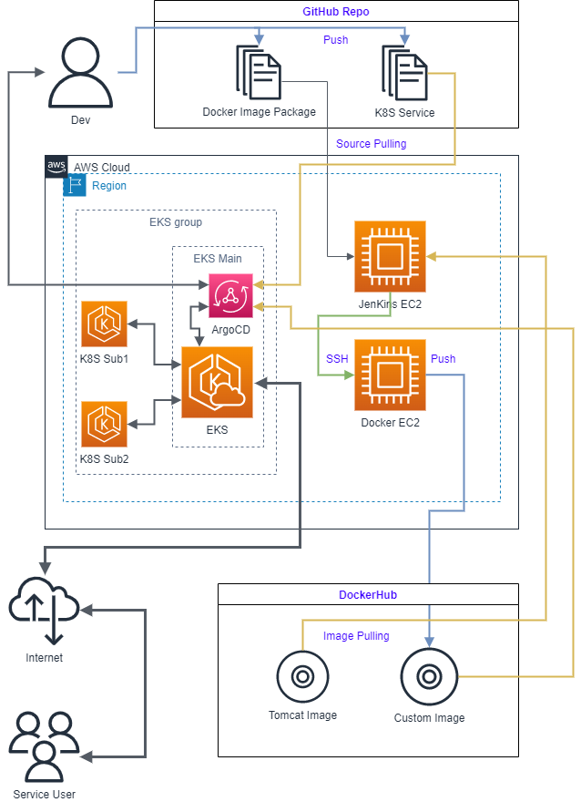
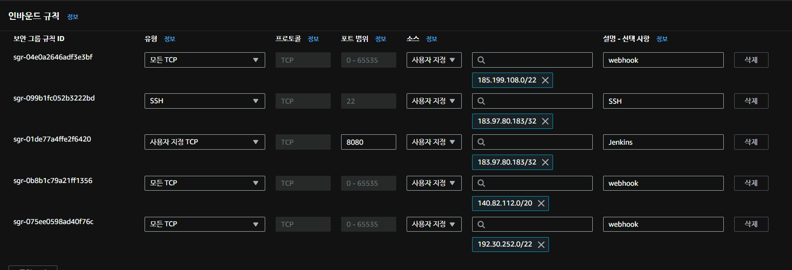
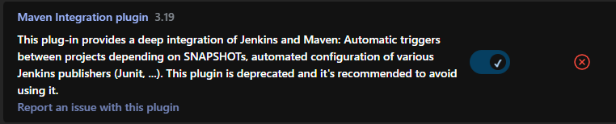
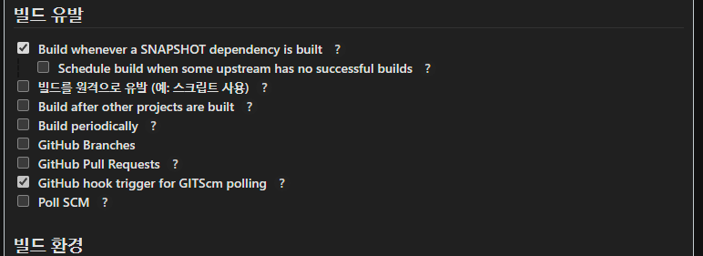
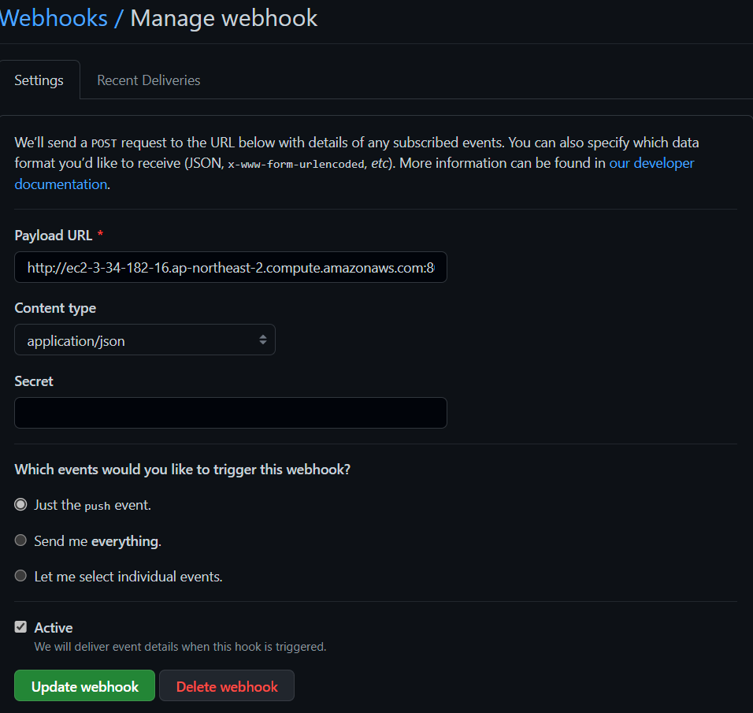
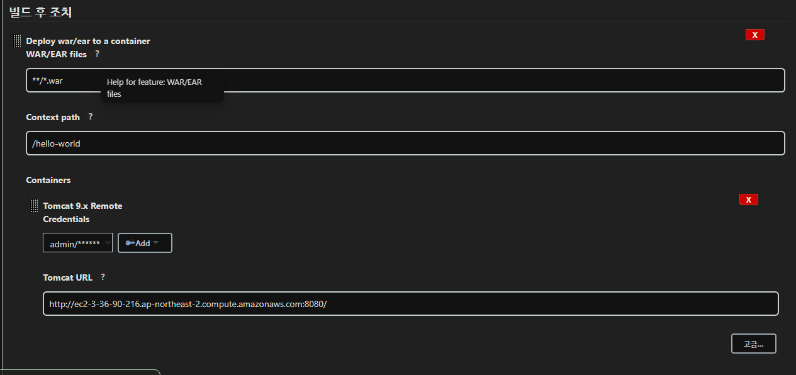
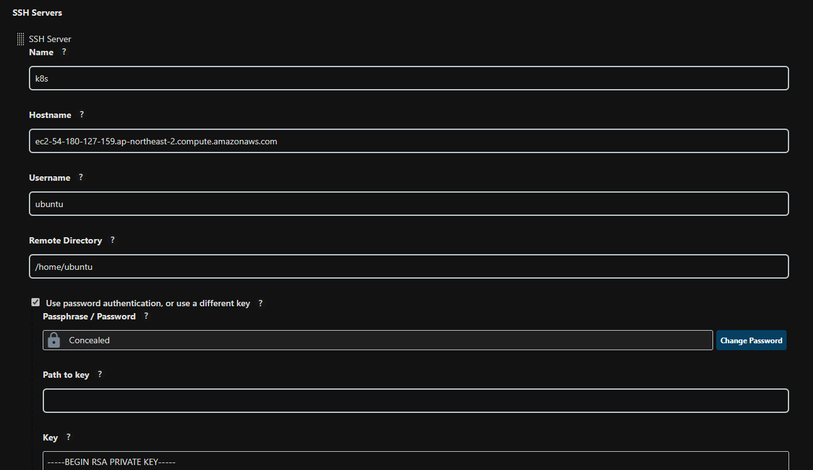
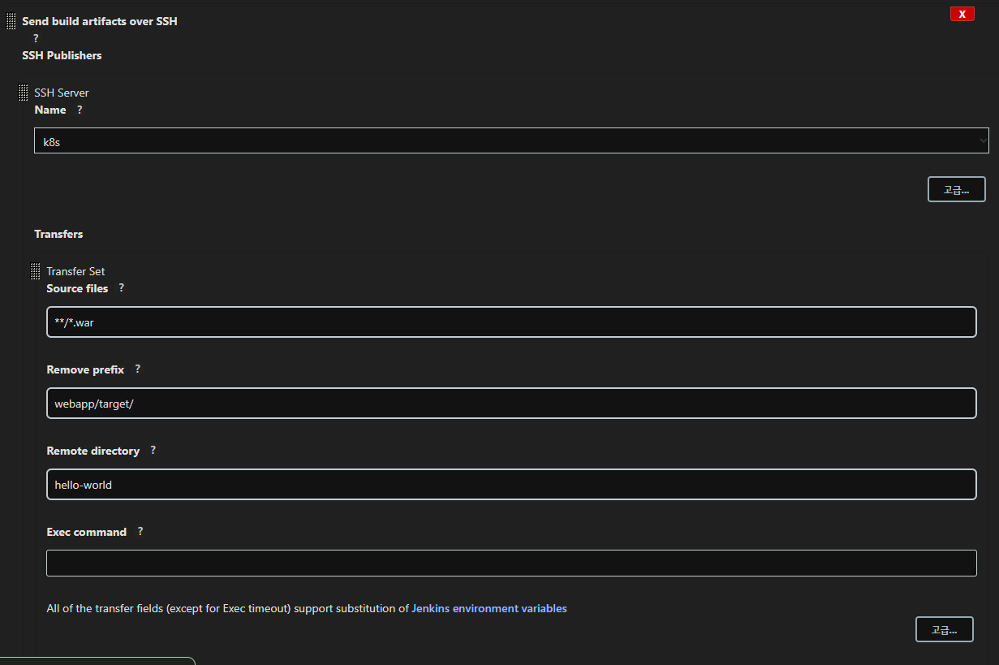
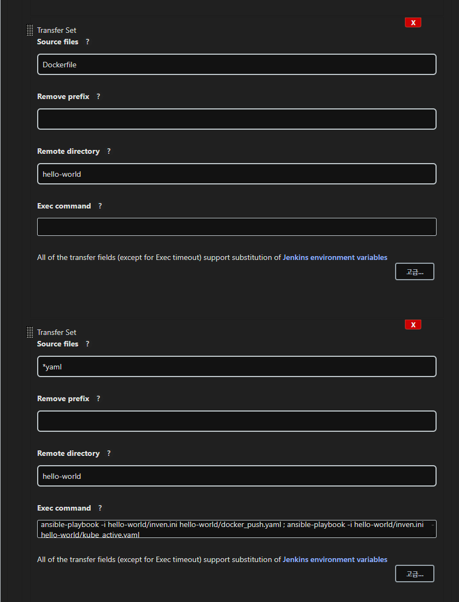

# Jenkins EC2


## 젠킨스 설치, GitHub 소스 실시간 빌드 세팅

```
sudo apt update 
sudo apt install openjdk-11-jdk -y
```

우분투 패키지 네임 업데이트

자바 개발자 도구 설치


```
curl -fsSL https://pkg.jenkins.io/debian-stable/jenkins.io.key | sudo tee \
    /usr/share/keyrings/jenkins-keyring.asc > /dev/null
```

젠킨스 저장소 키 다운로드

```
echo "deb [signed-by=/usr/share/keyrings/jenkins-keyring.asc] \
    https://pkg.jenkins.io/debian-stable binary/" | sudo tee \
    /etc/apt/sources.list.d/jenkins.list > /dev/null
```

우분투 패키지리스트에 추가

```
sudo apt-get update
sudo apt-get install fontconfig jenkins -y
```

우분투 패키지 네임 업데이트

젠킨스 설치




```
"192.30.252.0/22"
"185.199.108.0/22"
"140.82.112.0/20"
```
GitHub Webhook IP

```
sudo vim /etc/default/jenkins

HTTP_PORT=9090
```
젠킨스 액세스 포트 8080 > 9090으로 변경
미변경시 톰캣에서 8080을 기본으로 사용하기에 충돌 발생

AWS 보안그룹에서 8080, 9090 포트, GitHub API IP 액세스 허용

EC2 엔드포인트:9090으로 젠킨스 접속, 초기 세팅




Maven / Github Intergration plugin, Deploy to container Plugin 설치



젠킨스 프로젝트에서 GitHub hook trigger for GITScm polling 옵션 활성화



 GIthub Repo > Settings > Webhooks에서 Webhook 생성

 - Payload URL: 젠킨스 접속 URL/github-webhook/
 - Content type: application/json


커밋/푸시 후 GitHub Hook Log에서 확인


## 로컬 톰캣서버 세팅

```
sudo apt install tomcat9 tomcat9-admin
```

톰캣 설치하기

```
`/etc/tomcat9/tomcat-users.xml`

<tomcat-users xmlns="http://tomcat.apache.org/xml"
              xmlns:xsi="http://www.w3.org/2001/XMLSchema-instance"
              xsi:schemaLocation="http://tomcat.apache.org/xml tomcat-users.xsd"
              version="1.0">
        <role rolename="manager-gui"/>
        <role rolename="manager-script"/>
        <role rolename="manager-jmx"/>
        <role rolename="manager-status"/>
        <user username="아이디" password="비밀번호" roles="manager-gui, manager-script, manager-jmx, manager-status"/>
</tomcat-users>
```

유저, 비밀번호 설정



빌드 후 조치에서 파일 경로, 배포 위치, 톰캣 로그인 정보, 톰캣 주소 입력

빌드 후 톰캣/배포위치에서 확인

## SSH로 타 EC2에 배포


```
ssh-keygen -t rsa -b 4096 -m PEM
```

SSH 키 생성

```
~/.ssh/authorized_keys

ssh-rsa ...
1XQ== ubuntu@ip-10-0-5-51

```

수신 EC2에 공개키 등록



젠킨스 관리 > 환경설정 > SSH 서버
이름, 연결 주소, 유저명(ubuntu는 ubuntu, AML 2는 ec2-user),
연결 위치, 비밀키 입력 후 테스트



빌드 후 조치에서 Send build artifacts over SSH 선택 후 세팅


# EC2 K8s

Docker, Ansible, K8s(Kubespay) 설치

```
FROM tomcat:9-jre11-openjdk

COPY webapp.war /usr/local/tomcat/webapps
```

```
- hosts: ansible_host
  gather_facts: no

  tasks:

    - name: Build and Push Image
      docker_image:
        build:
          path: /home/ubuntu/hello-world
        name: ordahsmaesa/hello-world

        push: yes
        source: build

```

```
- hosts: docker_host
  gather_facts: no

  tasks:
    - name: Remove Container
      docker_container:
        name: hello-world
        state: absent
      ignore_errors: yes

    - name: Create Container
      docker_container:
        name: hello-world
        image: ordahsmaesa/hello-world
        state: started
        recreate: yes
        ports:
          - "8080:8080"

```

Dockerfile, yaml 작성



SSH로 전송 후 Ansible로 빌드, 배포하기

# EKS

## EKS 클러스터 구축


```
choco install awscli aws-iam-authenticator eksctl kubernetes-helm
```

온프레미스에 eksctl 설치

```
apiVersion: eksctl.io/v1alpha5
kind: ClusterConfig

metadata:
  name: myeks-custom
  region: ap-northeast-2
  version: "1.22"

# AZ
availabilityZones: ["ap-northeast-2a"]

# IAM OIDC & Service Account
iam:
  withOIDC: true
  serviceAccounts:
    - metadata:
        name: aws-load-balancer-controller
        namespace: kube-system
      wellKnownPolicies:
        awsLoadBalancerController: true
    - metadata:
        name: ebs-csi-controller-sa
        namespace: kube-system
      wellKnownPolicies:
        ebsCSIController: true
    - metadata:
        name: cluster-autoscaler
        namespace: kube-system
      wellKnownPolicies:
        autoScaler: true

# Managed Node Groups
managedNodeGroups:
  # On-Demand Instance
  - name: myeks-ng1
    instanceType: t2.micro
    minSize: 2
    desiredCapacity: 2
    maxSize: 2
    privateNetworking: true
    ssh:
      allow: true
      publicKeyPath: ./keypair/myeks.pub
    availabilityZones: ["ap-northeast-2a"]
    iam:
      withAddonPolicies:
        autoScaler: true
        albIngress: true
        cloudWatch: true
        ebs: true

# Fargate Profiles
fargateProfiles:
  - name: fg-1
    selectors:
    - namespace: dev
      labels:
        env: fargate
        
        
# CloudWatch Logging
cloudWatch:
  clusterLogging:
    enableTypes: ["*"]
```
```
mkdir keypair
ssh-keygen -f keypair/myeks
```

인증키 만들기

```
eksctl create cluster -f myeks.yaml
```

eks  클러스터 제작

## ArgoCD 설치

```
kubectl create ns argocd
```

argocd 네임스페이스 생성


```
kubectl apply -n argocd \
-f https://raw.githubusercontent.com/argoproj/argo-cd/stable/manifests/install.yaml
```

argocd 설치


접속 후 GitHub 저장소에서 yaml 파일 로드해서 실행